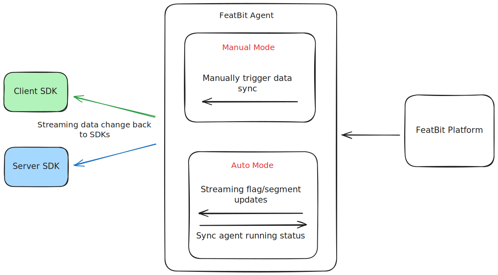

# FeatBit Agent

The FeatBit Agent is a fast and lightweight application designed to **run within your infrastructure**, sitting between
FeatBit SDKs and the Evaluation Server (ELS). It acts as a read replica of the ELS, handles all SDK connections, and
delivers updates to downstream SDKs in real-time.

Rather than every client/server connecting directly to the FeatBit platform and streaming changes, they will connect
directly to your installed agent to receive any flag updates. The agent can support connecting to multiple environments
across different projects for your organization, making it a 1:1 replacement for a direct connection.



## Use Cases

You may consider setting up the FeatBit Agent in the following scenarios:

- **Performance and Reliability**: The FeatBit Agent can help reduce latency by deploying closer to your downstream
  SDKs, enabling faster streaming responses. It serves as a local cache that continues to function even during
  FeatBit platform outages, ensuring high availability and resilience for your applications.
- **Air-gapped environments**: You may be required to operate in environments without internet connectivity. In this
  situation, running the FeatBit Agent in `manual` mode provides the capabilities of FeatBit without using external
  services.
- **Reducing outbound connections**: With the default configuration, each SDK instance you run will reach out to
  the FeatBit to fetch all the initial flag data, then maintain an outbound streaming connection to receive any
  updates you make to that environment. Use the FeatBit agent so your servers can connect directly to hosts
  in your own data center, instead of connecting directly to FeatBit's streaming API.
- **Security and Privacy**: In environments with strict security protocols, your application might be restricted from
  establishing third-party connections. By deploying the FeatBit Agent within your customers' own environments, you can
  overcome this limitation. Since the agent operates locally, all user information will remain within your customers'
  environments.

## Quick Start

> [!WARNING]
> **Version Compatibility Notice**: This is FeatBit Agent v2, which requires **FeatBit v5.1.0 or later**. If you're using an older version of FeatBit, please use the [v1 agent instead](./docs/v1-install-and-run.md).

> [!NOTE]
> Before getting started, you should have a good understanding of what
> a [relay proxy](https://docs.featbit.co/relay-proxy/relay-proxy) is.

The easiest way to get started is using Docker:

### 1. Get the docker-compose file

```bash
mkdir featbit-agent && cd featbit-agent
curl -o docker-compose.yml https://raw.githubusercontent.com/featbit/featbit-agent/main/docker-compose.yml
```

### 2. Configure the agent

Edit the environment variables in `docker-compose.yml` according to your FeatBit setup:

| Variable      | Description                                                                                                                                   | Default |
|---------------|-----------------------------------------------------------------------------------------------------------------------------------------------|---------|
| ApiKey        | API Key of the relay proxy                                                                                                                    | `""`    |
| Mode          | Operation mode of the agent (`auto` or `manual`)                                                                                              | `auto`  |
| AgentId       | Unique identifier for the agent. Required when mode is `auto`                                                                                 | `""`    |
| StreamingUri  | Required when mode is `auto`. Evaluation server streaming uri, for example: `ws://your-els-server`                                            | `""`    |
| ForwardEvents | Whether forward insights data (flag evaluation result, end users, etc) to the FeatBit server                                                  | `true`  |
| EventUri      | Required when `ForwardEvents` is `true`. Event server uri, usually the same as evaluation server uri, for example: `http://your-event-server` | `""`    |

> [!TIP]
> For streaming settings, refer to the [Streaming Settings](https://github.com/featbit/featbit/tree/main/modules/evaluation-server#streaming) for more details.

### 3. Start the agent and verify it is running

```bash
docker-compose up -d
curl http://localhost:6100/health/liveness
```

Additionally, you can also run the agent using a single `docker run` command:

```bash
docker run -d \
  --name featbit-agent \
  -p 6100:6100 \
  -e Mode=auto \
  -e AgentId=docker-agent-001 \
  -e StreamingUri=ws://your-els-server \
  -e ApiKey=your-api-key \
  -e EventUri=http://your-event-server \
  featbit/featbit-agent
```

## Connect SDKs to the Agent

To connect your SDKs to the FeatBit Agent, replace the `StreamingUri` and `EventUri` in your SDK options with the agent's address. Take the .NET SDK as an example:

```csharp
// setup SDK options to use the FeatBit Agent
var options = new FbOptionsBuilder("<replace-with-your-env-secret>")
    .Event(new Uri("http://<your-agent-host>"))
    .Streaming(new Uri("ws://<your-agent-host>"))
    .Build();
```

## Health Checks

The FeatBit Agent provides multiple health check endpoints to monitor its operational status:

### Liveness Check

```bash
curl http://your-agent-host:6100/health/liveness
```

This endpoint verifies that the agent has started and is running. It performs a basic health check to confirm the agent
is up and can respond to HTTP requests.

### Readiness Check

```bash
curl http://your-agent-host:6100/health/readiness
```

This endpoint verifies if the agent is fully operational and ready to serve streaming requests:

- **Auto mode**: Confirms the agent has successfully fetched initial data from the evaluation server and the data
  synchronizer is in a `stable` state
- **Manual mode**: Confirms the agent has been properly bootstrapped with configuration data

> [!TIP]
> Use the `/health/readiness` endpoint in your orchestration tools (like Kubernetes) to ensure traffic is only routed to
> fully operational agent instances.

## API Endpoints

The FeatBit Agent provides several API endpoints for manual mode operations and administrative tasks.
Check the [API documentation](./docs/api.md) for a complete list of available endpoints and their usage.

### Getting Support

- For troubleshooting, please read [troubleshooting guide](./docs/troubleshooting.md) first.
- If you have a specific question about using this agent, we encourage you to [ask it in our Slack](https://join.slack.com/t/featbit/shared_invite/zt-1ew5e2vbb-x6Apan1xZOaYMnFzqZkGNQ).
- If you encounter a bug or would like to request a feature, [submit an issue](https://github.com/featbit/featbit-agent/issues/new).